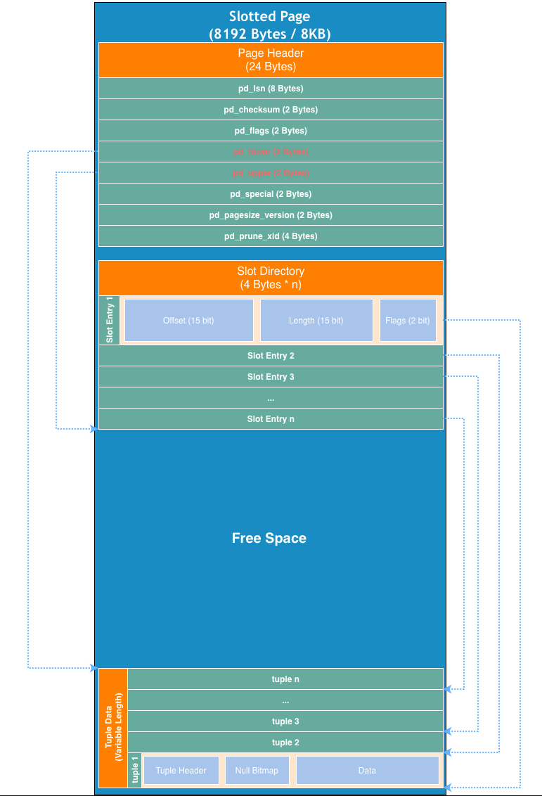

# Physical Storage Design Specification

> Language: **English** | [日本語](Physical-Storage-Design.ja.md)

The storage engine models PostgreSQL's on-disk structures and adopts the
**Slotted Page** layout. A fixed-size page manages variable-length records
efficiently, minimizing disk I/O.

---

## 1. Layout Constants

These map one-to-one to the constants in `internal/storage/slotted_page.go`.

| Constant          | Value  | Meaning                                   |
| :---------------- | :----- | :---------------------------------------- |
| `PageSize`        | 8192   | Page size in bytes (8 KB, PostgreSQL default) |
| `HeaderSize`      | 24     | Page header size in bytes                 |
| `SlotEntrySize`   | 4      | Size of a single slot entry in bytes      |
| `TupleHeaderSize` | 12     | Size of a tuple header in bytes           |

8 KB matches the block size of modern SSDs (notably the NVMe SSD on Apple
Silicon), which is the target hardware for this project.

---

## 2. Page Layout

The standard page size is **8,192 bytes (8 KB)**. The slot directory grows
downward from just after the header, while tuple data grows upward from the end
of the page; the gap between them (`pd_lower` … `pd_upper`) is the free space.



---

## 3. Page Header (24 bytes)

All multi-byte fields are **big-endian**.

| Offset | Length | Name           | Description                                                        |
| :----- | :----- | :------------- | :----------------------------------------------------------------- |
| 0      | 8      | `pd_lsn`       | Log Sequence Number — identifies the WAL record that last changed the page. |
| 8      | 2      | `pd_checksum`  | Checksum for write-time integrity verification.                    |
| 10     | 2      | `pd_flags`     | Page status flags (has free space, is index page, etc.).           |
| 12     | 2      | `pd_lower`     | **Free space start** — end of the slot directory (offset where the next slot is appended). |
| 14     | 2      | `pd_upper`     | **Free space end** — start of the tuple data area.                 |
| 16     | 2      | `pd_special`   | Special space — used by indexes (e.g. B-Tree sibling pointers).    |
| 18     | 2      | `pd_pagesize`  | Page size and layout version identifier.                           |
| 20     | 4      | `pd_prune_xid` | Oldest transaction id whose dead tuples may be pruned (VACUUM).     |

---

## 4. Slot Directory & Slot Entry (4 bytes each)

The slot directory is an array of fixed 4-byte **slot entries** occupying
`[HeaderSize, pd_lower)`. Each entry acts as an indirection: the slot number
(ID) stays stable even when the physical tuple moves within the page.

### Slot Entry bit layout (32 bits, big-endian)

```
bit 31                    17 16                      2 1        0
+---------------------------+--------------------------+---------+
|        Offset (15b)       |        Length (15b)      |Flags(2b)|
+---------------------------+--------------------------+---------+
```

| Field    | Bits | Range      | Meaning                                        |
| :------- | :--- | :--------- | :--------------------------------------------- |
| `Offset` | 15   | 0 – 32767  | Start offset of the tuple within the page.     |
| `Length` | 15   | 0 – 32767  | Byte length of the tuple this slot points to.  |
| `Flags`  | 2    | see below  | Physical state of the slot (line pointer).     |

### Slot flags (line-pointer state)

| Value | Name       | Meaning                                                     |
| :---- | :--------- | :---------------------------------------------------------- |
| `00`  | `UNUSED`   | Slot is free and may be reused.                             |
| `01`  | `NORMAL`   | Slot points to a live tuple.                                |
| `10`  | `DELETED`  | Tuple is dead; slot reclaimable after VACUUM.               |
| `11`  | `REDIRECT` | Slot redirects to another slot (for update chains / HOT).   |

> These flags describe the **physical** state of the line pointer, independent
> of MVCC visibility. Logical visibility is decided by the tuple's
> `t_xmin` / `t_xmax` (Section 5).

---

## 5. Tuple

A tuple is laid out as: **tuple header → null bitmap (optional) → column data**.

```
0            12            t_hoff                          Length
+------------+-------------+--------------------------------+
| TupleHeader| null_bitmap |          column data           |
|  12 bytes  | ceil(n/8)   |                                |
+------------+-------------+--------------------------------+
```

- `null_bitmap` is present only when the `HASNULL` hint bit is set; it holds
  one bit per column.
- `t_hoff` records the offset from the tuple start to the column data, i.e. it
  points past the header and null bitmap. It replaces a redundant total-size
  field, since the tuple's total byte length already lives in `SlotEntry.Length`.

### 5.1 Tuple Header (12 bytes, big-endian)

| Offset | Length | Field                  | Description                                            |
| :----- | :----- | :--------------------- | :----------------------------------------------------- |
| 0      | 4      | `t_xmin`               | Id of the transaction that **inserted** the tuple.     |
| 4      | 4      | `t_xmax`               | Id of the transaction that **deleted** the tuple; `0` means the tuple is still live. |
| 8      | 2      | `flags`(6b) + `col_count`(10b) | MVCC hint bits (6 bits) + number of columns (10 bits, 0–1023). |
| 10     | 1      | `t_hoff`               | Offset from tuple start to column data.                |
| 11     | 1      | —                      | Reserved (padding / future use).                       |

### 5.2 MVCC hint bits (the 6-bit `flags` field)

Hint bits cache the commit/abort status of `t_xmin` / `t_xmax` so that
visibility checks can avoid a lookup into the transaction status log (CLOG,
introduced in the transaction phase).

| Bit | Name             | Meaning                                          |
| :-- | :--------------- | :----------------------------------------------- |
| 0   | `HASNULL`        | A null bitmap follows the header.                |
| 1   | `XMIN_COMMITTED` | The inserting transaction is known committed.    |
| 2   | `XMIN_ABORTED`   | The inserting transaction is known aborted.      |
| 3   | `XMAX_COMMITTED` | The deleting transaction is known committed.     |
| 4   | `XMAX_ABORTED`   | The deleting transaction is known aborted.       |
| 5   | —                | Reserved.                                        |

### 5.3 Visibility rule (simplified)

A tuple is visible to a snapshot **S** when:

1. `t_xmin` is committed and visible to **S**, **and**
2. `t_xmax` is invalid (`0`), **or** the deleting transaction is aborted, **or**
   it is not yet committed/visible to **S**.

Full evaluation depends on the transaction status log and snapshot logic, which
belong to the transaction phase. The storage layer only reserves the fields
(`t_xmin`, `t_xmax`, hint bits) that this rule requires.

---

## 6. Core Logic: Dual-Directional Growth

The defining trait of the slotted page is that its two regions grow **toward
each other**:

1. **Slot Directory** grows downward from just after the header. Each 4-byte
   entry records where a tuple lives (`Offset`) and its `Length`. Because the
   slot number is stable, the tuple can be relocated within the page without
   invalidating references to it.
2. **Tuple Data** grows upward from the end of the page.
3. **Free Space** is the gap between `pd_lower` (end of slot directory) and
   `pd_upper` (start of tuple data). The page is considered **full** once
   `pd_lower + SlotEntrySize > pd_upper` (no room for another slot + tuple).

---

## 7. References

- [PostgreSQL Documentation: Database Page Layout](https://www.postgresql.org/docs/current/storage-page-layout.html)
